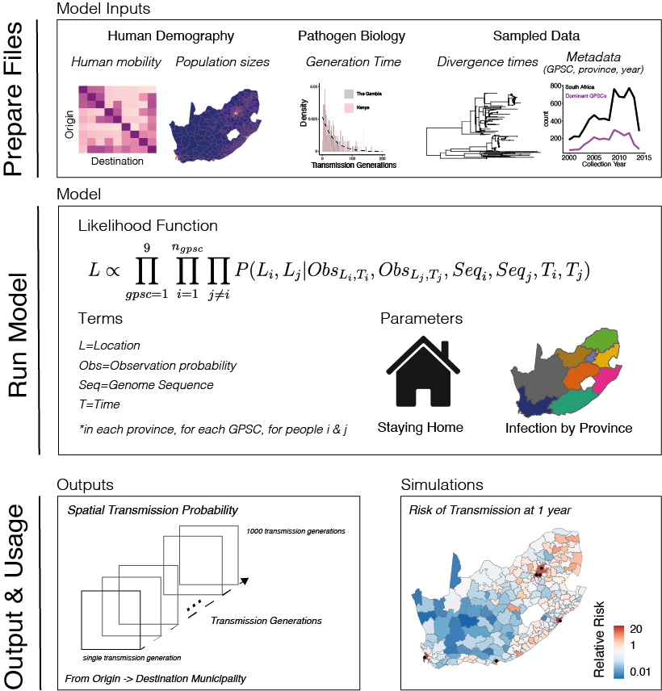

# Analysis for geographic mobility of *Streptococcus pneumoniae* including human mobility model and the relative risk framework
*This code was run with R version 3.6.1 which is necessary for Rcpp*
## Human Mobility Model Analysis
This analysis integrates human mobility data and genomic data to mechanistically understand pneumococcal migration in South Africa.
<p align="center">
  
</p>

### Install R packages. 
```install.packages(c("raster","rgdal","data.table","doParallel","ucminf","doMC","Rcpp","RcppEigen","Rfast","abind","ggplot2","fmcmc","coda","dplyr","ape","lubridate","tmaptools","geodist","PBSmapping","stringi","maptools","tidyr","stringr","ComplexHeatmap","circlize","patchwork"))```

### Process raw input data.*
**Links throughout allow to you to download processed data* <br />
<br />
Raw input data is in this folder:
```./scripts/manage_rawData/```
1) **Landscan Data** (https://landscan.ornl.gov/) <br />
*This script reads in the landscan population data and associated shapefiles from GADM (https://gadm.org/data.html)or can download the shapefiles here (https://figshare.com/s/73ca1408ae3ed18ff658) to create a datatable with all population levels ad the municipality (N=234) level population sizes.*  
Script: ```031122_LandScanMunic.R``` <br />
Output: ```./data/landscan2017/LandScan_PopulationN.RData```  <br />
OR <br />
Download this folder from FigShare (https://figshare.com/s/1d702d56dbf8c5829829)<br />
Unzip and place files in ```./data/landscan2017/```<br />

 Download this folder from FigShare (https://figshare.com/s/675e41ed68ece18c5c61)<br />
  Run this code ```mkdir ./data/landscan2017``` <br />
  Unzip downloaded files and place them in ```./data/landscan2017/```<br />
  ```mkdir ./data/shapefiles```<br />
  Download South Africa shapefiles from GADM (https://gadm.org/data.html)<br />
  Unzip downloaded files and place them in ```./data/shapefiles/```<br />
  
2) **Facebook Data** (https://dataforgood.facebook.com/) <br />
*This script reads in the raw facebook mobility data from the disaster movement range maps (data downloaded from FigShare URL).*<br />
Script: ```facebook_rawData.R``` <br />
Output: ```./data/landscan2017/landscan_populations.RData```  <br />
```./data/facebook/mvment_SA.provinces.RData```  <br />
Download this folder from FigShare (https://figshare.com/s/1d702d56dbf8c5829829) <br />
Unzip downloaded files and place them in ```./data/landscan2017/```<br />
Download this folder from FigShare (https://figshare.com/s/7eb72568387c476e62f5) and place ```mvment_SA.provinces.RData``` in ```./data/facebook/``` <br />

### Create model input files
Scripts to generate input files location: ```./scripts/createinputs/``` <br />
Output RData files location: ```./modelinput_data/``` <br />
1) **Human Mobility** <br />
*This script creates probability of moblity matrices at the province level (9X9) and the municipality level (234X234)*  
Script: ```mobility_probability.R``` <br />
Output: Province Mobility:```./modelinput_data/cdr.mat.one.RData ``` <br />
Municipality Mobility:```./modelinput_data/cdr.mat.town.one.RData ``` <br />
2) **Municipality Population Sizes** <br />
Script: ```mobility_probability.R``` <br />
Output: Municipality Populations:```./modelinput_data/pop_municipality.2017LS.RData```  <br />
3) **Metadata for Likelihood**<br />
*This creates a list of length 9 (number of GPSCs) containing 8 columns with information for each pair including ids, collection location (province numbered 1-9), time in days between pairs, collection year for each pair.*<br />
Script: ```031122_GPSC_metadata.R```<br />
Output: Metadata File: ```./modelinput_data/dat.tmp.allser.RData```<br />
Population size (province): ```./modelinput_data/pop_2019.RData: ```<br />
4) **tMRCA between pairs**<br />
*This creates a list of length 9 (number of GPSCs) with pairwise time to MRCA for each pair (half the time between pairs (years)).*<br />
Script: ```031122_makeGDistMatrix.R```<br />
Output: ```./modelinput_data/tMRCAs.RData```<br />
4) **Pairwise distance (km) between locations**<br />
*This creates a matrix containing the pairwise distances in kms between the 9 South African provines, and another matrix with the distances between the 234 municipalities.*<br />
Script: ```031122_031122_PairwiseDistance.R```<br />
Output: ```./modelinput_data/pairwise_geodist.town.RData & ./modelinput_data/pairwise_geodist.RData```<br />

*Can download all model input files into ```./data/modelinput_data/``` from this FigShare (https://figshare.com/s/361552cabfa381acf6c2)*

### Run MCMC Model<br />
*You will have to create an output directory to write the chains to and can then run the code to fit the model*<br />
  ```cd ./MCMC_model/```<br/>
 ```mkdir outputs```<br/>
 **Files**<br/>
Likelihoods Functions: ```./MCMC_model/LikelihoodFunctions/```<br />
Matrix Multiplication Cpp file: ```./MCMC_model/MatrixMultiplication.cpp```<br />
Run Model Files: ```./MCMC_model/HumMob/RunModel/041122_Pneumo_MCMC_MUNIC.R```<br />
1) Open ```./MCMC_model/RunModel/HumMob/041122_Pneumo_MCMC_MUNIC.R``` <br />
2) Set the number of iterations ```iters=20000```
3) Set the chain ID ```chain=1```
4) Load R on your cluster environment and submit a job with ```Rscript ./MCMC_model/RunModel/HumMob/041122_Pneumo_MCMC_MUNIC.R```
5) Repeat with at least 3 chains remembering to change the ```chain``` variable as this will prevent your files from overwriting each other.

### Test Model Fit <br />
*Test your model fit against the data*
1) Run code: ```mkdir ./MCMC_model/TestFit/Plots``` & ```mkdir ./MCMC_model/TestFit/Data```
2) Open ```051122_MunicFitTest.R```
3) Set the number of iterations to match the number of iterations in your model run under variable ```iters```


### Simulations to Test Model Function <br />
*This is a file to simulate a true epidemic, sub-sample the phylogeny, and fit the data on the sub-sampled phylogeny representing the true incompleteness inherent to data. This is simulated with a parameter of -2 input and we are able to recapture it with the model.*
1) Navigate to ```./MCMC_model/Simulations/```
2) ```mkdir output``` & ```mkdir Plots```
3) Open ```./MCMC_model/Simulations/051122_Simulate_fit_CLUSTER.R```
4) Set the number of iterations ```iters=20000``` & scale ```scale=0.06```
5) Run ```./MCMC_model/Simulations/051122_Simulate_fit_CLUSTER.R```
6) To plot and the true data, sub-sampled data, and model fit run ```./MCMC_model/Simulations/051122_Simulate_Recapture_CLUSTER.R```

### Model Projection Simulations <br />
*These are the scripts to simulate pneumococcal transmission*
```./ModelProjections/```
1) Load the 3 chains from the model with 20000 iterations from (https://figshare.com/s/5761f8d7ace15fb22b9d)
2) ```mkdir ./ModelProjections/data/``` & ```mkdir ./ModelProjections/plots/```
3) Generate the 234X234Xnumber of transmission generations array using ```051122_234X234_MobPerGen.R```
4) Run ```051122_map_plots.R``` to generate the relative risk of transmission after on year maps as well as the rural vs. urban transmission initiations maps.
5) Run ```051122_NMunicSim.R``` to simulate the branching epidemic.
6) To vary whether the start location is Rural (<50per/km2) or Urban (>500per/km2) run ```051122_RuralUrbanNMunic.R```. 

### Generation Time Estimates <br />
*Take the carriage duration estimates from The Gambia and Kilifi, Kenya (Abdullahi et al., 2012 and Chaguza et al., 2021) and estimate the transmission generation distribution using simulation* <br />
Script: ```./CarriageDurations/061122_Carriage_GenTime.R```<br />
Output: Plot into ```./CarriageDurations/```<br />
## Relative Risk Analysis
*This is an Rmarkdown file detailing the relative risk analysis both at the lineage level, with time resolved trees, categorically & continuously. You can toggle the ```sub``` and ```disease``` variables ```TRUE``` or ```FALSE``` depending on whether you want to sub-sample or only use disease isolates.*<br />
Script: ```./RelativeRisk/061122_RRScript.Rmd```<br />
1) Navigate to the folder. ```cd RelativeRisk/```
2) ```mkdir plots```
3) Open ```061122_RRScript.Rmd``` and run the code chunks to produce the same data files you downloaded in the ```./RelativeRisk/files/``` folder. 
4) Open ```RR_plots.R``` to reproduce the relative risk plots from the paper


